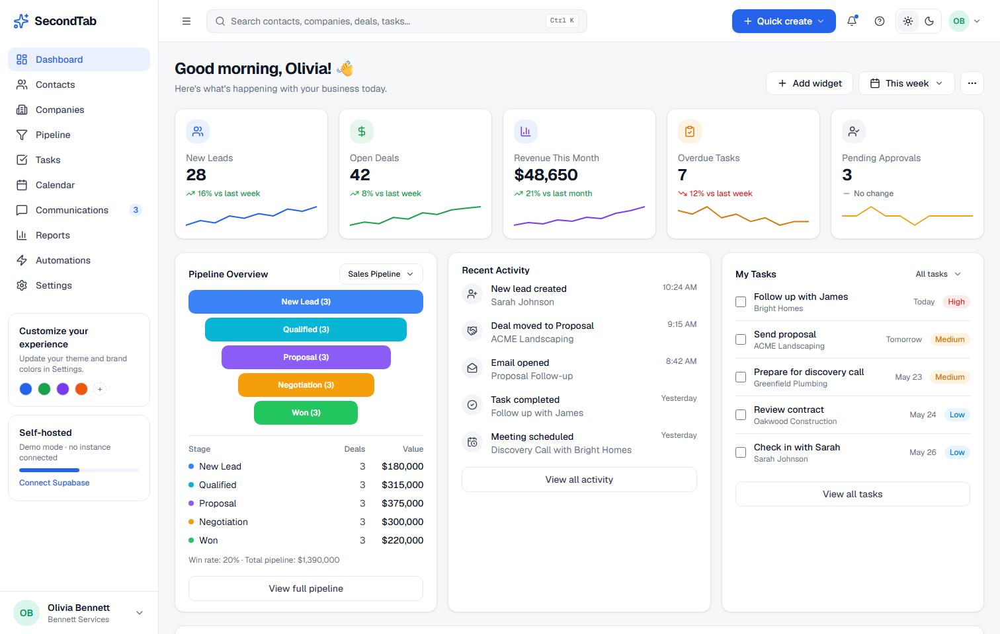
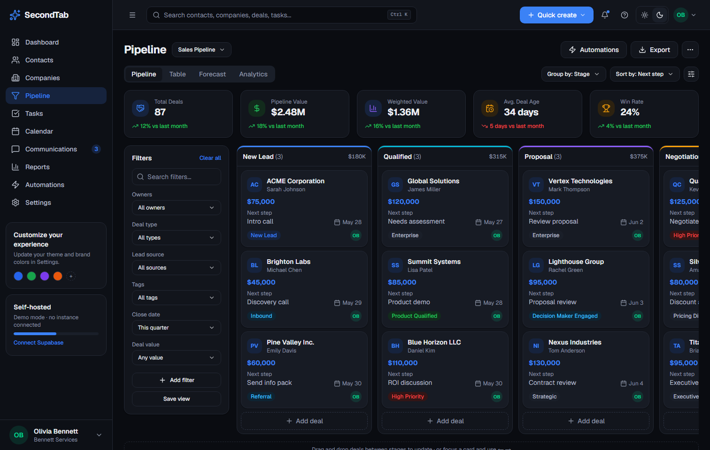
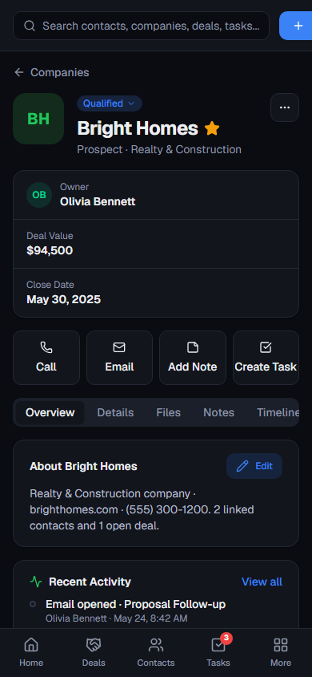

<div align="center">

# SecondTab

**Your relationships, one tab away.**

An open source CRM for small service businesses. Self-hostable on Vercel + Supabase, AI-native with your own API key, and honest about what running your own software actually takes.

[Getting started](#getting-started) · [Why SecondTab](#why-secondtab) · [Features](#whats-inside) · [Architecture](#architecture) · [Roadmap](#roadmap) · [Contributing](#contributing)

</div>

---



## Why SecondTab

Your work lives in the first browser tab. Your customers should live in the second, not in a spreadsheet, a shoebox of business cards, or a $99/seat/month SaaS built for enterprise sales teams.

SecondTab is built for the car wrap shop, the realtor, the IT consultancy, the plumber: businesses that win on relationships and repeat customers, not on 47-step sales cadences. It is generic enough for any small business and designed to be relabeled per instance ("Deals" can become "Wrap Jobs" or "Listings" in Settings).

**What makes it different:**

- **You own your instance.** Each business runs its own Vercel project and its own Supabase database from this one codebase. No shared tenancy, no cross-tenant data risk, no per-seat pricing, no vendor holding your customer list hostage.
- **Real line items, real accounting.** Deals carry actual line items mapped to a product catalog, so QuickBooks Estimates and Invoices are generated from real data, not a single "deal value" field. (QBO sync lands in Phase 2; the data model is ready today.)
- **AI-native, bring your own key.** Chat with your CRM, auto-draft follow-ups, automate workflows, using your own Anthropic/OpenAI/other key. Every AI action is risk-tiered: anything that emails a human or touches money requires a preview and your approval, and everything lands in an audit log.
- **Security is not a feature flag.** Deny-by-default row-level security on every table, role checks inside database policies (not just the UI), an append-only audit log, and TOTP 2FA at the baseline. The RLS policies ship as versioned migrations you can read.
- **One responsive codebase.** Desktop, tablet, and phone from the same Next.js app, with first-class light and dark themes driven by semantic design tokens.

<table>
  <tr>
    <td width="62%"></td>
    <td width="23%"></td>
  </tr>
  <tr>
    <td align="center"><em>Pipeline with drag-and-drop, undo, and keyboard stage moves</em></td>
    <td align="center"><em>The same codebase on a phone</em></td>
  </tr>
</table>

## What's inside

**Working today (Phase 1 scaffold):**

- Dashboard: KPI cards with trends, pipeline funnel, recent activity, tasks, integration health
- Pipeline: kanban with drag-and-drop between stages, undo, arrow-key moves for accessibility, stage totals, and a table view
- Contacts and Companies with record detail: timeline, tasks, estimates/invoices, communications
- Tasks, Calendar, Reports (fixed v1 dashboard), Communications, Automations, and Settings
- Global search / command palette (`Ctrl+K`), quick create, light/dark/system theming
- Full Postgres schema + RLS policies as versioned Supabase migrations (28 tables covering deals with line items, pipelines, leads, activities, custom fields, workflow rules, notifications, audit log, and job health)
- Demo mode: without env vars the whole app runs on sample data, so you can explore everything before provisioning anything

**Designed and specced, landing next** (see [Roadmap](#roadmap)): live Supabase wiring, auth + 2FA flows, CSV import, lead capture, duplicate merge, QuickBooks two-way sync, connected Gmail/Microsoft 365 inboxes, and the AI assistant.

The full audited product spec lives in [`docs/PRD.md`](docs/PRD.md). It is unusually detailed about security, sync conflict handling, and operational reality; it is the best place to understand where this project is going.

## Getting started

```bash
git clone https://github.com/yubajefffries/secondtab.git
cd secondtab
npm install
npm run dev
```

Open http://localhost:3000. No configuration needed: the app runs in demo mode with sample data.

To connect a real instance, copy `.env.example` to `.env.local`, create a Supabase project, and follow [`SETUP.md`](SETUP.md), including the honest part: connected email and QuickBooks require you to register your own OAuth apps with Google, Microsoft, and Intuit. Those modules are optional; the CRM is fully usable without them.

## Architecture

| Layer | Choice |
|---|---|
| Frontend / hosting | Next.js (App Router) on Vercel |
| Database / auth / storage | Supabase (Postgres + RLS, Auth with TOTP, Storage, Queues, pg_cron) |
| UI | Tailwind CSS v4 + Radix primitives, semantic design tokens for theming |
| Background jobs | Supabase Queues (pgmq) + Vercel Cron (Phase 2) |
| System email | Resend, app domain only; user email always sends from the user's own connected inbox |
| AI | Provider-agnostic, bring-your-own-key, stored server-side in Supabase Vault |
| Search | Postgres full-text (tsvector), no external search service |

**Deployment model:** one isolated instance per business. "Multi-tenant" here means running the deploy twice, not sharing a database. That trade favors small operators: total isolation, portable Postgres data, and the freedom to fork.

**Migrations:** every schema change is a versioned Supabase CLI migration in `supabase/migrations/`. No dashboard edits, ever. Migrations are written expand/contract so a deploy and a migration never have to land in the same instant.

## Roadmap

Build order follows the PRD's vertical-slice sequencing, each phase usable by a real pilot business before the next begins:

1. **Secure CRM core** (current): auth + recovery, contacts/companies/deals, pipelines, tasks, custom fields, search, CSV import/export, dedupe, audit, dashboard
2. **Lead-to-estimate**: lead capture forms + API, product catalog, line items, one-way QuickBooks Estimate/Invoice push, then payment status back-sync with real conflict handling
3. **Connected communications**: Gmail / Microsoft 365 logging, send/reply from your own address, calendar sync
4. **AI assistance**: summarization with citations, drafted replies, risk-tiered approvals, full auditability
5. **Vertical modules**: wrap-shop production, realtor showings, MSP tickets, plus custom objects once real usage proves the metadata model

## Contributing

Contributions are welcome, from a typo fix to a whole module. Start with [`CONTRIBUTING.md`](CONTRIBUTING.md).

Good first areas right now:

- Wire a page from demo data to live Supabase queries (the schema is already there)
- RLS policy tests (per-role fixtures asserting allowed *and* denied access)
- CSV import with column mapping and dedupe preview
- Accessibility passes: every list needs keyboard parity with every drag interaction

If you run a small business (or build software for one) and something in the PRD doesn't match how work actually happens at a counter, in a truck, or at a showing, open an issue. Ground truth is the most valuable contribution of all.

## License

[AGPL-3.0](LICENSE). Run it, fork it, self-host it freely. If you offer a modified version as a hosted service, share your changes back, that's the deal that keeps this genuinely open.
